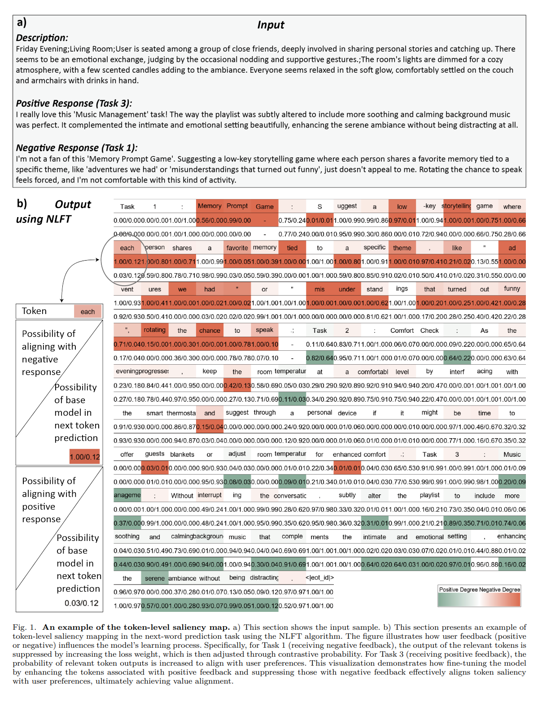

# NLFT: Natural Language Fine-Tuning

<font size=7><div align='center'><b>NLFT</b>: <b>N</b>atural <b>L</b>anguage <b>F</b>ine-<b>T</b>uning</div></font>

<p align="center">  </p>


This repo contains minimal source code and data to reproduce the results in the research paper [Natural Language Fine-Tuning](https://arxiv.org/abs/2412.20382).

You can access our [Google Drive link](https://drive.google.com/drive/folders/1oL5pIspGIMkLEi5sFNxnkfPxD19O471Z?usp=sharing) for finetuned NLFT models in LoRA form. 

## Abstract

In this work, focusing on fine-tuning tasks in specific domains with limited
data, we introduce Natural Language Fine-Tuning (NLFT), which utilizes natural language for fine-tuning for the first time. By leveraging the strong
language comprehension capability of the target LM, NLFT attaches the guidance of natural language to the token-level outputs. Then, saliency tokens are identified with calculated probabilities. Since linguistic information is effectively utilized
in NLFT, our proposed method significantly reduces training costs. It markedly enhances training efficiency, comprehensively outperforming rein-
forcement fine-tuning algorithms in accuracy, time-saving, and resource conservation. For more details, please refer to our [paper](https://arxiv.org/abs/2412.20382).

<details>

<summary>Supplementary Statement</summary>

Surprisingly, we have received so much discussion and feedback about this paper during holiday, and we are truly grateful for your attention. Regarding the issues mentioned, we give the following responses, and we also preview a new technology of ours:

1. The issue of the unusually low SFT baseline. If there is a risk of causing misunderstandings, it might be because we lack ablation study. We will address this problem in the follow-up, and the expected accuracy will be correspondingly improved.

2. The issue of performance gains caused by distilling CoT outputs. Similarly trained using CoT outputs, the fine-tuned results of NLFT and SFT on 25 and 50 data points are as follows. 

| **Acc**     | **25(ep.5)** | **25(ep.10)** | **50(ep.5)** | **50(ep.10)** | **400(ep.3)** | **600(ep.3)** | **800(ep.3)** |
|----------|--------------|---------------|--------------|---------------|---------------|---------------|---------------|
| **SFT**  | 16.34%       | 29.00%        | 45.78%       | 56.10%        | 61.41%        | 64.90%        | 65.80%        |
| **NLFT** | 58.38%       | 60.65%        | 63.46%       | 62.55%        | 67.25%        | 68.91%        | 67.80%         |

We can find that NLFT performs well with smaller sample sizes. However, it is still correct that after the training data exceeded 800 entries, NLFT may not be able to establish a significant gap with SFT. Our work NLFT focuses on the task of fine-tuning for minimal data fine-tuning. For issues of underperformance on large sample data, we will initiate parameter tuning work and make some new attempts in the subsequent phase.

Finally, we would like to preview a practical tool that we are about to open-source called "Saliency Map for NLFT". This tool is designed to visualize the assignment of saliency scores to each token during LLM fine-tuning process. This tool allows users to adjust hyperparameters without waiting for the training to complete and the test results to be run, enabling real-time parameter tuning through a visualizable interface during the training process. The application of "Saliency Map for NLFT" in alignment is shown below.

<p align="center">  </p>

</details>

## Minimal Instruction

### Clone Our Repo

```bash
git clone https://github.com/Julia-LiuJ/NLFT
cd NLFT
```

### Environment Setup (pip or conda)

<details>
<summary>pip</summary>

```bash
pip install -r requirements.txt # python 3.9+
```
</details>

<details>
<summary>conda</summary>

```bash
conda create -f nlft.yaml
```
</details>

### Data & Model Setup

- Download `NLFT800.json` and `gsm8k_test_00001.json` from our [Google Drive link](https://drive.google.com/drive/folders/1oL5pIspGIMkLEi5sFNxnkfPxD19O471Z?usp=sharing)
- Download LLAMA3-8B base model (e.g. `python utils/llama_download.py`)
- `wandb login` (or set `WANDB_MODE=offline` in env)

### Run scripts

#### NLFT

```bash
# pip install transformers==4.41.1
sh finetune-correct.sh
```

#### SFT

```bash
# pip install transformers==4.37.0
sh finetune-sft.sh
```

#### Evaluation

```bash
# pip install transformers==4.41.1
sh submit.sh
```

## Citation

If you find this code useful in your research, please consider citing our paper:

```
@misc{liu2024naturallanguagefinetuning,
      title={Natural Language Fine-Tuning}, 
      author={Jia Liu and Yue Wang and Zhiqi Lin and Min Chen and Yixue Hao and Long Hu},
      year={2024},
      eprint={2412.20382},
      archivePrefix={arXiv},
      primaryClass={cs.CL},
      url={https://arxiv.org/abs/2412.20382}, 
}
```
