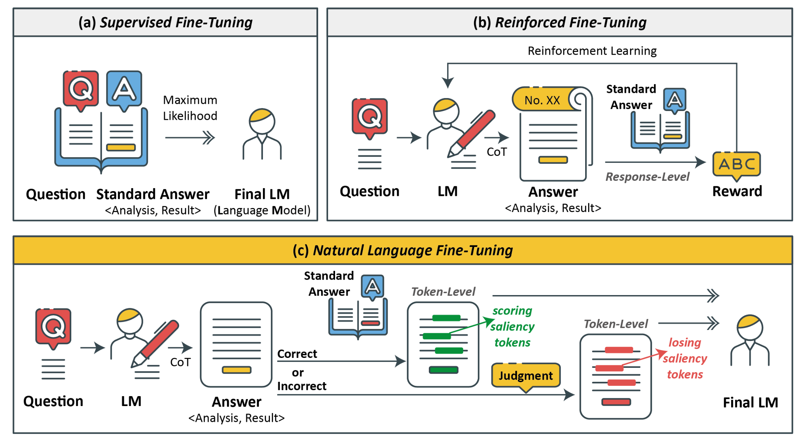

# NLFT: Natural Language Fine-Tuning

<font size=7><div align='center'><b>NLFT</b>: <b>N</b>atural <b>L</b>anguage <b>F</b>ine-<b>T</b>uning</div></font>

<p align="center">  </p>


This repo contains minimal source code and data to reproduce the results in the research paper [NLFT: Natural Language Fine-Tuning](#).

You can access our [Google Drive link](https://drive.google.com/drive/folders/1oL5pIspGIMkLEi5sFNxnkfPxD19O471Z?usp=sharing) for finetuned NLFT models in LoRA form. 

## Abstract

In this work, focusing on fine-tuning tasks in specific domains with limited
data, we introduce Natural Language Fine-Tuning (NLFT), which utilizes natural language for fine-tuning for the first time. By leveraging the strong
language comprehension capability of the target LM, NLFT attaches the guidance of natural language to the token-level outputs. Then, saliency tokens are identified with calculated probabilities. Since linguistic information is effectively utilized
in NLFT, our proposed method significantly reduces training costs. It markedly enhances training efficiency, comprehensively outperforming rein-
forcement fine-tuning algorithms in accuracy, time-saving, and resource conservation. For more details, please refer to our [paper](#).

## Minimal Instruction

### Clone Our Repo

```bash
git clone https://github.com/Julia-LiuJ/NLFT
cd NLFT
```

### Environment Setup (pip or conda)

<details>
<summary>pip</summary>

```bash
pip install -r requirements.txt # python 3.9+
```
</details>

<details>
<summary>conda</summary>

```bash
conda create -f nlft.yaml
```
</details>

### Data & Model Setup

- Download `NLFT800.json` and `gsm8k_test_00001.json` from our [Google Drive link](https://drive.google.com/drive/folders/1oL5pIspGIMkLEi5sFNxnkfPxD19O471Z?usp=sharing)
- Download LLAMA3-8B base model (e.g. `python utils/llama_download.py`)
- `wandb login` (or set `WANDB_MODE=offline` in env)

### Run scripts

#### NLFT

```bash
# pip install transformers==4.41.1
sh finetune-correct.sh
```

#### SFT

```bash
# pip install transformers==4.37.0
sh finetune-sft.sh
```

#### Evaluation

```bash
# pip install transformers==4.41.1
sh submit.sh
```

## Citation

If you find this code useful in your research, please consider citing our paper:

```

```
